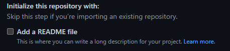

# Creación de un archivo README.

**Requisitos:**
- [Visual Studio Code](https://code.visualstudio.com/)
- [Extensión Markdown](https://marketplace.visualstudio.com/items?itemName=bierner.markdown-shiki)
- [Git](https://git-scm.com/downloads)
- Cuenta en GitHub

----------------------------------------

*Introducción:*

Les mostraré una forma sencilla en la que pueden documentar prácticas desde VS Code, o bien, desde el mismo GitHub mediante archivos README. Estos sirven para comunicar información importante de tu proyecto.

---------------------------------------

### Subir un README desde VS Code a un repositorio ded GitHub.

1. Desde tu VS Code abrirás una carpeta donde desees guardar tus archivos.

En esta carpeta crearás un archivo llamdo:

    README.md

Una ves hayas creado este archivo podrás comenzar a escribir, subir imagenes, poner links, etc.
Te recomeindo mucho descargar la extención:

    Markdownlint

Con esto podrás acceder a una vista previa de lo que estes haciendo desntro de tu archivo README.

-------------------------------------------

- Tips:

    Para añadir titulos utiliza la tecla # antes del texto, ejemplo:
    

Para añadir letra cursiva a alguna palabra o texto usa * antes de comenzar y al terminar una frase, palabra o texto.

Siquieres añadir negrita para resaltar algo usa el doble ** al principio y final.

Para añadir una imagen te recomeindo crear una carpeta donde tienes tu archivo README y guarda las imagenes dentro de la misma.

Para subir la imagen escribe el comando siguiente:

Dentro de los paréntesis vas a copiar la ruta de acceso relativa de la imagen, esta la obtienes dando clic derecho a la imagen que desees usar y ahí encontraras una lista de funciones, busca la anterior mensionada. Es importante que cambies la barra ( \ ) por ( / ) para que se puedan visualizar en GitHub. El formato de imagen debe ser PNG.

-------------------------------------------

2. Euna vez termindado tu archivo ingresa a tu perfil de GitHub busca tus repositorios y crea uno nuevo.

Dale un nombre y si gustas también puedes darle una descripción.

**Nota:** Puedes crear un archivo README desde GitHub y editarlo desde ahí también.

Deja los demás valores en predeterminado y crea el repositorio.
Cuando finalize te mostrará una página como la siguiente:

Aquí tenemos varias formas de agregar un archivo README pero nostros unaremos la primera que es mediante comandos en la terminal de VS Code.

1. Abre una nueva terminal en tu VS Code donde esta tu archivo README y copea los comandos 1 por 1 que te proporciona Github.

**Nota:** Para esta parte es importante que tengas [Git](https://git-scm.com/downloads) instalado.

Si quieres agregar todos los archivos que tengas dentro de una carpeta puedes utilizar el siguiente comando.
   
     git add .

Esta funsión también añade archivos con código.

Una vez que hayas terminado regresa tu repositorio y recarga la página.

Ahora tienes una forma sencilla y rápida de documentar desde VS Code.

